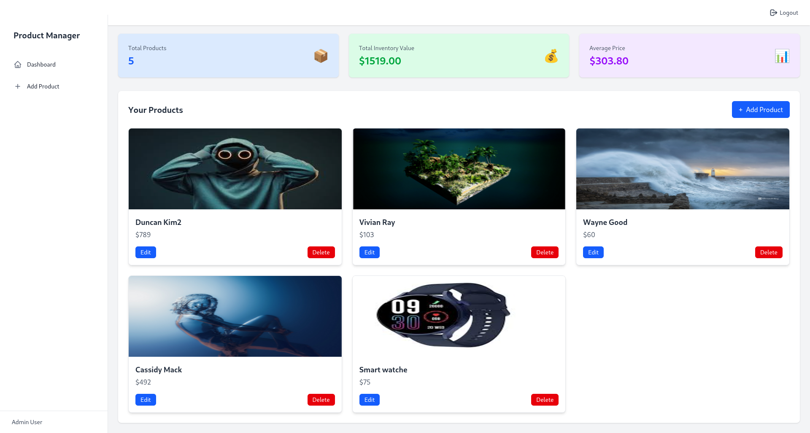

# Product Management Dasboard

This is a MERN (MongoDB, Express.js, React, Node.js) stack application for product management. It features user registration, login with JWT-based authentication, and CRUD operations for managing products. The backend handles secure API routes, while the React frontend offers a responsive UI styled with Tailwind CSS. Toast notifications provide real-time user feedback for actions like login, logout, and product updates.

Dasboard:

